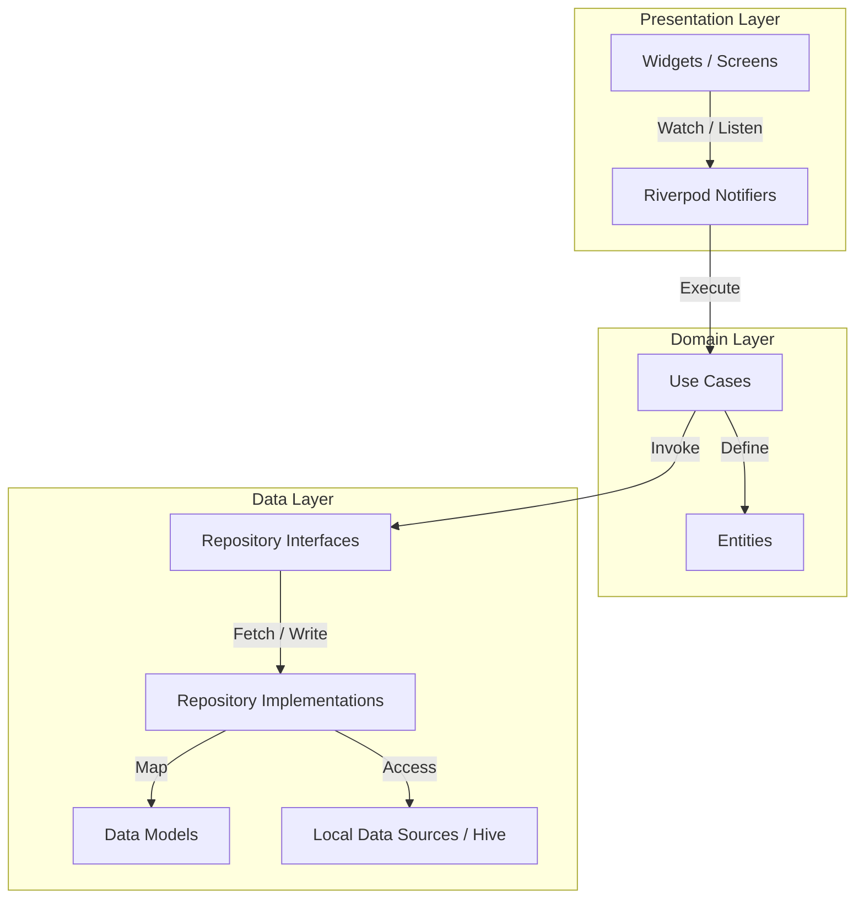

# OmniCalc: Modern Clean Architecture Flutter Calculator Suite

A premium, glassmorphic, and highly interactive Flutter utility application built from the ground up using **Clean Architecture** principles. OmniCalc merges five daily utility tools into a single, cohesive, modern workspace featuring tactile micro-animations, glowing active UI elements, customizable ambient gradients, and a fully persistent theme customizer.

---

## 🌟 Key Features

### 1. 🧮 Standard Calculator
* **Custom Mathematical Parser**: Driven by a recursive-descent parsing engine that evaluates expression trees in real time, handling complex operator precedence, parentheses, decimals, and percentage structures.
* **Smart Backspace & Decimals**: Supports intuitive character erasure and direct decimal insertion (`.`) preventing multiple decimal errors in a single number block.
* **Instant Evaluation Preview**: Displays live results on the display panel as you type.

### 2. 📅 Age Calculator
* **Cupertino Wheel Picker**: A sleek date interface that enables quick selection of birth dates.
* **Comprehensive Breakdown**: Displays age in Years, Months, and Days simultaneously.
* **Statistics Dashboard**: Renders a 2x3 statistics grid showing total months, weeks, days, hours, minutes, and seconds lived.
* **Next Birthday Countdown**: Draws a circular radial progress ring showing exact months and days remaining until your next birthday.

### 3. ⚖️ BMI Calculator
* **Neon Gender Selectors**: Sleek, glassmorphic male/female cards that glow with active neon outlines when selected.
* **Dual Unit Systems**: Swap seamlessly between Metric (cm/kg) and Imperial (in/lb) sliders with customized thumbs and track heights.
* **Vector Health Gauge**: A custom-drawn color-coded arc gauge displaying an indicator needle showing your precise BMI category (Underweight, Normal, Overweight, Obese).
* **Actionable Recommendations**: Displays a checkbox checklist of health recommendations tailored to your category.

### 4. 📐 Length & Weight Converters
* **Bidirectional Conversion**: Converts units (e.g., meter, centimeter, kilometer, inch, feet, yard, mile / gram, kilogram, ounce, pound, stone) in real time.
* **Floating Swap button**: Swaps the source and target units instantly with smooth transitions.
* **Tactical Numerical Keypad**: Integrates a custom aspect-ratio key grid with specialized entry states and focused glowing cards.

### 5. 🎨 Theme System
* **Curated Harmonious Themes**:
  * **AMOLED Dark Mode**: Midnight Obsidian background with Electric Violet, Neon Cyan, and Rose accents.
  * **Pastel Light Mode**: Soft Lavender-Sky background with Rich Indigo and Teal details.
* **Theme Persistence**: Settings are persisted locally via Hive so your selected theme mode remains saved across app restarts.
* **Ambient Animations**: Smoothed rotations and fade-ins on the sun/moon icon during toggles.

---

## 🏗️ Clean Architecture Layout

The codebase strictly follows standard clean separation of concerns, divided into modular feature domains:



### Folder Structure
```text
lib/
├── core/
│   ├── router/          # GoRouter shell configuration
│   ├── services/        # Local databases (Hive initialization)
│   └── theme/           # Dark and Light theme specifications
├── features/
│   ├── standard_calc/   # Math parser, history adapter, standard screen
│   ├── age_calc/        # Birthday countdown tracker, Cupertino pickers
│   ├── bmi_calc/        # Dynamic sliders, health recommendation lists
│   ├── length_conv/     # Bidirectional scales, aspect keypads
│   └── weight_conv/     # Bidirectional scales, aspect keypads
└── main.dart            # Root initialization entrypoint
```

---

## 🛠️ Technology Stack & Libraries

* **Core Framework**: Flutter (Dart SDK `>=3.8.0`)
* **State Management**: **Flutter Riverpod (v3)** utilizing modern Notifier classes for robust, testable state flows.
* **Local Persistence**: **Hive & Hive Flutter** for instant, lightweight database boxes saving historical results and user settings.
* **Navigation Router**: **GoRouter** for advanced, decoupled declarative layout paths.
* **Data Helper**: **Equatable** for value-based model object comparisons.

---

## 🧪 Testing & Code Quality

The codebase enforces high code quality, clean styling rules, and zero deprecations:
* **100% Clean Compilation**: Verified under `flutter analyze` with zero warnings, lint errors, or unreferenced assets.
* **Automated Test Coverage**: Comprises unit and widget tests testing:
  * Parser precedence and decimal boundaries.
  * Age calculation calendar edge-cases.
  * Imperial and Metric BMI formulas.
  * Bidirectional converter notifier state machines and database records.

---

## 🚀 Getting Started

### Prerequisites
Make sure your Flutter development environment is configured:
* Flutter SDK (>=3.8.0)
* Dart SDK

### Installation
1. Clone the repository:
   ```bash
   git clone https://github.com/your-username/calculator.git
   cd calculator
   ```

2. Retrieve dependencies:
   ```bash
   flutter pub get
   ```

3. Run the static analyzer:
   ```bash
   flutter analyze
   ```

4. Run the automated test suite:
   ```bash
   flutter test
   ```

5. Launch the app in debug mode:
   ```bash
   flutter run
   ```
